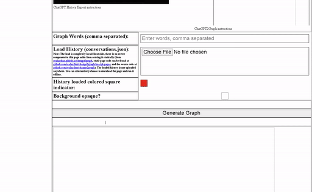
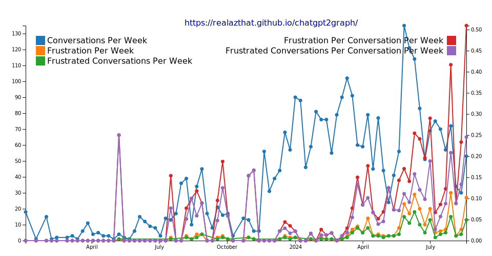
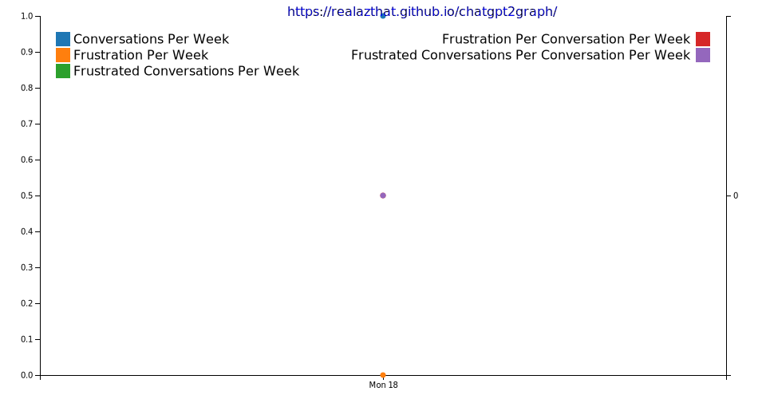

<!--

WARNING: This file is auto-generated by snipinator. Do not edit directly.
SOURCE: `.github/README.md.jinja2`.

-->
<!--


-->

# <div align="center">[![ChatGPT2Graph][1]][2]</div>

<div align="center">

Try: [realazthat.github.io/chatgpt2graph][2]

</div>

<div align="center">

<!-- Icons from https://lucide.dev/icons/users -->
<!-- Icons from https://lucide.dev/icons/laptop-minimal -->

![**Audience:** Developers][3] ![**Platform:** Linux][4]

</div>

<p align="center">
  <strong>
    <a href="#-features">🎇Features</a> &nbsp;&bull;&nbsp;
    <a href="#-installation">🏠Installation</a> &nbsp;&bull;&nbsp;
    <a href="#-usage">🚜Usage</a> &nbsp;&bull;&nbsp;
    <a href="#-command-line-options">💻CLI</a>
  </strong>
</p>
<p align="center">
  <strong>
    <a href="#-requirements">✅Requirements</a>
    &nbsp;&bull;&nbsp;
    <a href="#-docker-image">🐳Docker</a>
    &nbsp;&bull;&nbsp;
    <a href="#-gotchas-and-limitations">🚸Gotchas</a>
  </strong>
</p>

<div align="center">

![Top language][5] [![GitHub License][6]][7] [![npm - version][8]][9]

[![Node Version][10]][11]

**Graph ChatGPT usage over time.**

</div>

---

<div align="center">

|                   | Status                      | Stable                    | Unstable                  |                    |
| ----------------- | --------------------------- | ------------------------- | ------------------------- | ------------------ |
| **[Master][12]**  | [![Build and Test][13]][14] | [![since tagged][15]][16] |                           | ![last commit][17] |
| **[Develop][18]** | [![Build and Test][19]][14] | [![since tagged][20]][21] | [![since tagged][22]][23] | ![last commit][24] |

</div>



- ❔ What: A web page (and CLI) to generate a graph from exported ChatGPT
  history.
- Why: I wanted to know if I was going crazy, or, if ChatGPT was actually
  getting worse over time.



## 🎇 Features

- Uses OpenAI's history export feature.
- Graph to SVG or PNG.
- Graph frustrations over time.

## 🏠 Installation

```bash
# Option 1: Install globally from npm registry:
npm install -g chatgpt2graph

# Option 2: Or install globally, direct from GitHub:
npm install -g https://github.com/realazthat/chatgpt2graph.git#v0.1.0

# Option 3: Or install in a directory:
git clone https://github.com/realazthat/chatgpt2graph
cd chatgpt2graph
npm install
```

## 🚜 Usage

Example:

<!---->
```bash

npx chatgpt2graph \
  -i ./examples/conversations.json \
  -w idiot \
  -o "./examples/simple_example_output.svg"

ls "./examples/simple_example_output.svg"

```
<!---->

<!---->

<!---->

And the resulting graph (svg):



## Running Page On Your Machine

```bash

# Option 1: In a directory installation, Start the development server (directory from the source code):
npm run start
# Navigate to http://localhost:1234/chatgpt2graph/. Note the trailing slash!

# Option 2: In a directory installation, Build first in dist/ and then serve:
npm run build
npm run serve
# Navigate to http://localhost:3000/chatgpt2graph/. Note the trailing slash!

```

## 💻 Command Line Options

<!---->

<!---->

## ✅ Requirements

- Supported Node versions: `>=18.0.0 <19.0.0 || >=20.0.0 <21.0.0 || >=21.0.0 <22.0.0 || >=22.0.0 <23.0.0` (See
  [./package.json](./package.json)). These versions were chosen from
  current supported and upcoming versions of node, from
  [Node.js: Previous Releases](https://nodejs.org/en/about/previous-releases).
- Tested Node versions on GitHub Actions: `["18.20.2","20.12.1","21.7.3","22.0.0"]`.

### Tested on

- WSL2 Ubuntu 20.04, Node `v20.12.1`.

## 🐳 Docker Image

Docker images are published to [ghcr.io/realazthat/chatgpt2graph][49] at each
tag.

<!---->
```bash

# Use the published images at ghcr.io/realazthat/snipinator.
# /data in the docker image is the working directory, so paths are simpler.
docker run --rm --tty \
  -u "$(id -u):$(id -g)" \
  -v "${PWD}:/data" \
  ghcr.io/realazthat/chatgpt2graph:v0.1.0 \
  -i ./examples/conversations.json \
  -w idiot \
  -o "./examples/simple_example_output.svg"

ls "./examples/simple_example_output.svg"

```
<!---->

If you want to build the image yourself, you can use the Dockerfile in the
repository.

<!---->
```bash

docker build -t my-chatgpt2graph-image .

# /data in the docker image is the working directory, so paths are simpler.
docker run --rm --tty \
  -u "$(id -u):$(id -g)" \
  -v "${PWD}:/data" \
  my-chatgpt2graph-image \
  -i ./examples/conversations.json \
  -w idiot \
  -o "./examples/simple_example_output.svg"

ls "./examples/simple_example_output.svg"

```
<!---->

## 🤏 Versioning

We use SemVer for versioning. For the versions available, see the tags on this
repository.

## 🔑 License

This project is licensed under the MIT License - see the
[./LICENSE.md](./LICENSE.md) file for details.

## 🫡 Contributions

### Development environment: Linux-like

- For running `pre.sh` (Linux-like environment).

  - From [./.github/dependencies.yml](./.github/dependencies.yml), which is used for
    the GH Action to do a fresh install of everything:

    ```yaml
    bash: scripts.
    findutils: scripts.
    grep: tests.
    xxd: tests.
    git: scripts, tests.
    xxhash: scripts (changeguard).
    rsync: out-of-directory test.
    expect: for `unbuffer`, useful to grab and compare ansi color symbols.
    jq: dependency for [yq](https://github.com/kislyuk/yq), which is used to generate
      the README; the README generator needs to use `tomlq` (which is a part of `yq`)
      to query `pyproject.toml`.
    libcairo2-dev: For node canvas library.
    libjpeg-dev: For node canvas library.
    libpango1.0-dev: For node canvas library.
    libgif-dev: For node canvas library.
    build-essential: For node canvas library.
    g++: For node canvas library.
    ffmpeg: For compressing the demo videos for the web.
    gifsicle: Optimizing demo videos.
    
    ```

  - Requires `pyenv`, or an exact matching version of python as in
    [scripts/.python-version](scripts/.python-version) (which is currently
    `3.8.18
`).
  - `jq`, ([installation](https://jqlang.github.io/jq/)) required for
    [yq](https://github.com/kislyuk/yq), which is itself required for our
    [./README.md](./README.md) generation, which uses `tomlq` (from the
    [yq](https://github.com/kislyuk/yq) package) to include version strings from
    [./scripts/pyproject.toml](./scripts/pyproject.toml).
  - act (to run the GH Action locally):
    - Requires nodejs.
    - Requires Go.
    - docker.
  - Generate animation:
    - docker

### Commit Process

1. (Optionally) Fork the `develop` branch.
2. Stage your files: e.g `git add path/to/file.py`.
3. `bash ./scripts/pre.sh`, this will format, lint, and test the code. If there
   is an error then fix it and repeat this step.
4. `git status` check if anything changed (generated
   [README.md](README.md) for example), if so, `git add` the changes,
   and go back to the previous step.
5. `git commit` with an appropriately detailed commit message.
6. Make a PR to `develop` (or push to develop if you have the rights).

### Deplying to GH Pages

This requires permissions in the remote repository.

1. `npm run build` to build the site.
2. `npm run deploy` to deploy the site to GitHub Pages.

## 🔄🚀 Release Process

These instructions are for maintainers of the project.

1. In the `develop` branch, run `bash ./scripts/pre.sh` to ensure
   everything is in order.
2. In the `develop` branch, bump the version in
   [package.json](package.json), following semantic versioning
   principles. Run `bash ./scripts/pre.sh` to ensure everything is in order.
   - If anything got generated (e.g README or terminal output images), you will
     have to stage those.
3. In the `develop` branch, commit these changes with a message like
   `"Prepare release X.Y.Z"`. (See the contributions section
   [above](#commit-process)).
4. Merge the `develop` branch into the `master` branch:
   `git checkout master && git merge develop --no-ff`.
5. `master` branch: Tag the release: Create a git tag for the release with
   `git tag -a vX.Y.Z -m "Version X.Y.Z"`.
6. Publish to NPM: Publish the release to NPM with
   `bash ./scripts/deploy-to-npm.sh`. This step requires an NPM account with
   permissions to publish the package.
7. Push to GitHub: Push the commit and tags to GitHub with
   `git push && git push --tags`.
8. The `--no-ff` option adds a commit to the master branch for the merge, so
   refork the develop branch from the master branch:
   `git checkout develop && git merge master`.
9. Push the develop branch to GitHub: `git push origin develop`.

<!-- Logo from https://lucide.dev/icons/users -->

<!-- Logo from https://lucide.dev/icons/laptop-minimal -->

[1]: ./.github/logo-exported.svg
[2]: https://realazthat.github.io/chatgpt2graph
[3]:
  https://img.shields.io/badge/Audience-Developers|Users-0A1E1E?style=plastic&logo=data:image/svg+xml;base64,PHN2ZyB4bWxucz0iaHR0cDovL3d3dy53My5vcmcvMjAwMC9zdmciIHdpZHRoPSIyNCIgaGVpZ2h0PSIyNCIgdmlld0JveD0iMCAwIDI0IDI0IiBmaWxsPSJub25lIiBzdHJva2U9ImN1cnJlbnRDb2xvciIgc3Ryb2tlLXdpZHRoPSIyIiBzdHJva2UtbGluZWNhcD0icm91bmQiIHN0cm9rZS1saW5lam9pbj0icm91bmQiIGNsYXNzPSJsdWNpZGUgbHVjaWRlLXVzZXJzIj48cGF0aCBkPSJNMTYgMjF2LTJhNCA0IDAgMCAwLTQtNEg2YTQgNCAwIDAgMC00IDR2MiIvPjxjaXJjbGUgY3g9IjkiIGN5PSI3IiByPSI0Ii8+PHBhdGggZD0iTTIyIDIxdi0yYTQgNCAwIDAgMC0zLTMuODciLz48cGF0aCBkPSJNMTYgMy4xM2E0IDQgMCAwIDEgMCA3Ljc1Ii8+PC9zdmc+
[4]:
  https://img.shields.io/badge/Platform-Node-0A1E1E?style=plastic&logo=data:image/svg+xml;base64,PHN2ZyB4bWxucz0iaHR0cDovL3d3dy53My5vcmcvMjAwMC9zdmciIHdpZHRoPSIyNCIgaGVpZ2h0PSIyNCIgdmlld0JveD0iMCAwIDI0IDI0IiBmaWxsPSJub25lIiBzdHJva2U9ImN1cnJlbnRDb2xvciIgc3Ryb2tlLXdpZHRoPSIyIiBzdHJva2UtbGluZWNhcD0icm91bmQiIHN0cm9rZS1saW5lam9pbj0icm91bmQiIGNsYXNzPSJsdWNpZGUgbHVjaWRlLWxhcHRvcC1taW5pbWFsIj48cmVjdCB3aWR0aD0iMTgiIGhlaWdodD0iMTIiIHg9IjMiIHk9IjQiIHJ4PSIyIiByeT0iMiIvPjxsaW5lIHgxPSIyIiB4Mj0iMjIiIHkxPSIyMCIgeTI9IjIwIi8+PC9zdmc+
[5]:
  https://img.shields.io/github/languages/top/realazthat/chatgpt2graph.svg?&cacheSeconds=28800&style=plastic&color=0A1E1E
[6]:
  https://img.shields.io/github/license/realazthat/chatgpt2graph?style=plastic&color=0A1E1E
[7]: ./LICENSE.md
[8]:
  https://img.shields.io/npm/v/chatgpt2graph?style=plastic&color=0A1E1E
[9]: https://www.npmjs.com/package/chatgpt2graph
[10]:
  https://img.shields.io/node/v/chatgpt2graph?style=plastic&color=0A1E1E
[11]: https://www.npmjs.com/package/chatgpt2graph
[12]: https://github.com/realazthat/chatgpt2graph/tree/master
[13]:
  https://img.shields.io/github/actions/workflow/status/realazthat/chatgpt2graph/build-and-test.yml?branch=master&style=plastic
[14]:
  https://github.com/realazthat/chatgpt2graph/actions/workflows/build-and-test.yml
[15]:
  https://img.shields.io/github/commits-since/realazthat/chatgpt2graph/v0.1.0/master?style=plastic
[16]:
  https://github.com/realazthat/chatgpt2graph/compare/v0.1.0...master
[17]:
  https://img.shields.io/github/last-commit/realazthat/chatgpt2graph/master?style=plastic
[18]: https://github.com/realazthat/chatgpt2graph/tree/develop
[19]:
  https://img.shields.io/github/actions/workflow/status/realazthat/chatgpt2graph/build-and-test.yml?branch=develop&style=plastic
[20]:
  https://img.shields.io/github/commits-since/realazthat/chatgpt2graph/v0.1.0/develop?style=plastic
[21]:
  https://github.com/realazthat/chatgpt2graph/compare/v0.1.0...develop
[22]:
  https://img.shields.io/github/commits-since/realazthat/chatgpt2graph/v0.1.0/develop?style=plastic
[23]:
  https://github.com/realazthat/chatgpt2graph/compare/v0.1.0...develop
[24]:
  https://img.shields.io/github/last-commit/realazthat/chatgpt2graph/develop?style=plastic
